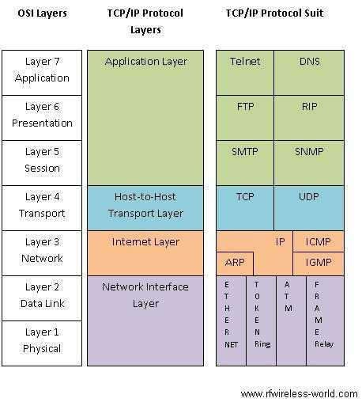

# OSI 7 Layer

* Open Systems Interconnection Model
* 시스템간 상호 연결을 목적으로 공통의 일련 절차를 참조할 수 있도록 제정한 것

#### 7계층은 왜 나눌까?

통신이 일어나는 과정을 단계별로 알 수 있고, 특정한 곳에 이상이 생기면 그 단계만 수정할 수 있기 때문이다.

##### 1) 물리(Physical)

> 리피터, 케이블, 허브 등

단지 데이터 전기적인 신호로 변환해서 주고받는 기능을 진행하는 공간

즉, 데이터를 전송하는 역할만 진행한다.

##### 2) 데이터 링크(Data Link)

> 브릿지, 스위치 등

**물리 계층으로 송수신되는 정보를 관리하여 안전하게 전달되도록 도와주는 역할**

**<u>Mac 주소</u>**를 통해 통신한다. 프레임에 Mac 주소를 부여하고 에러검출, 재전송, 흐름제어를 진행한다.

##### 3) 네트워크(Network)

> 라우터, IP

데이터를 목적지까지 가장 안전하고 빠르게 전달하는 기능을 담당한다.

라우터를 통해 이동할 경로를 선택하여 **IP 주소**를 지정하고, 해당 경로에 따라 패킷을 전달해준다.

라우팅, 흐름 제어, 오류 제어, 세그먼테이션 등을 수행한다.

##### 4) 전송(Transport)

> TCP, UDP

**TCP와 UDP 프로토콜을 통해 통신을 활성화**한다. **포트**를 열어두고, 프로그램들이 전송을 할 수 있도록 제공해준다.

- TCP : 신뢰성, 연결지향적
- UDP : 비신뢰성, 비연결성, 실시간

##### 5) 세션(Session)

> API, Socket

데이터가 통신하기 위한 **논리적 연결**을 담당한다. TCP/IP 세션을 만들고 없애는 책임을 지니고 있다.

##### 6) 표현(Presentation)

> JPEG, MPEG 등

**데이터 표현에 대한 독립성을 제공하고 암호화하는 역할**을 담당한다.

파일 인코딩, 명령어를 포장, 압축, 암호화한다.

##### 7) 응용(Application)

> HTTP, FTP, DNS 등

최종 목적지로, 응용 프로세스와 직접 관계하여 일반적인 응용 서비스를 수행한다.

사용자 인터페이스, 전자우편, 데이터베이스 관리 등의 서비스를 제공한다.

## 

|      |                                        |                   |                      |                      |
| ---- | -------------------------------------- | ----------------- | -------------------- | -------------------- |
| 계층 | 이름                                   | 단위              | 주소                 | 예시                 |
| 1    | **물리 계층 (Physical Layer)**         | 비트(bit)         |                      |                      |
| 2    | **데이터 링크 계층 (Data Link Layer)** | 프레임(frame)     | Physical             | `HDLC`, `PPP`, `LLC` |
| 3    | **네트워크 계층 (Network Layer)**      | 패킷(packet)      | Logical              | `X25`, `IP`          |
| 4    | **전송 계층 (Transport Layer)**        | 세그먼트(segment) | Port                 | `HDLC`, `PPP`, `LLC` |
| 5    | 세션 계층 (Session Layer)              | 메시지(message)   | Application-Specific |                      |
| 6    | 표현 계층 (Presentation Layer)         |                   |                      |                      |
| 7    | 응용 계층 (Application Layer)          |                   |                      |                      |

   

#### Encapsulation & Decapsulation

* 데이터를 송수신하기 위해 일어나는 과정을 일컫는 용어

## TCP/IP Protocol Suite

# 출처

* https://github.com/gyoogle/tech-interview-for-developer/
* https://github.com/Prev/CSE-Summary/

